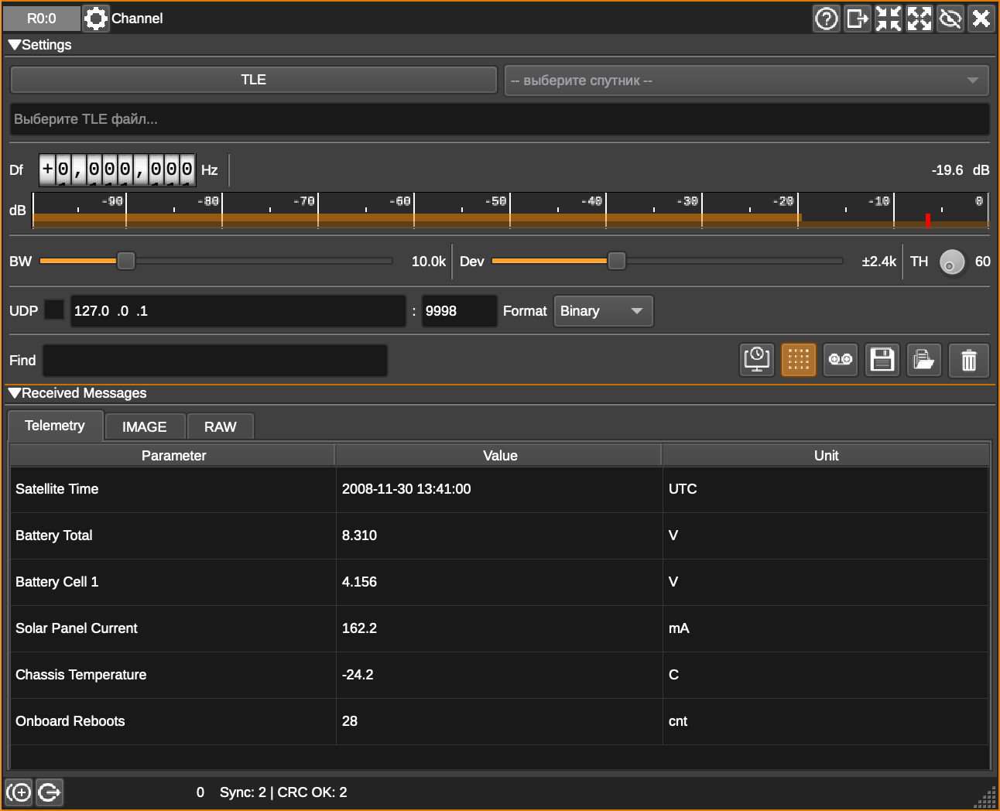

# Geoscan Satellite Decoder Plugin for SDRangel

Специализированный плагин для SDRangel, предназначенный для приёма, демодуляции и декодирования телеметрических кадров наноспутников серии Geoscan 3U (и совместимых).

<!-- markdownlint-disable MD033 -->

<!-- markdownlint-enable MD033 -->

## Основные возможности

- **GFSK Демодуляция**: Высокопроизводительный квадратурный дискриминатор для работы на скорости 9600 бод.
- **Поддержка протокола**: Полная совместимость с протоколом Геоскан 3U v2.7 (AX.25-подобные кадры).
- **Асинхронная архитектура**: Многопоточная обработка данных (DSP), обеспечивающая стабильный прием без задержек в интерфейсе.
- **Декодирование данных**:
  - Поиск преамбулы и синхрослова.
  - Дерандомизация потока (PN9).
  - Проверка целостности кадров (CRC16).
- **Визуализация**: Индикатор уровня сигнала (RSSI) в реальном времени и вкладка RAW для просмотра HEX-дампов принятых кадров.
- **FEC**: Мягкое декодирование Витерби (k=7, r=1/2) для коррекции ошибок при слабом сигнале.
- **Телеметрический дашборд**: Отображение в реальном времени напряжения АКБ, тока панелей, температуры и состояния систем.

## Установка

1. Скопируйте папку `geoscandecoder` в директорию `sdrangel/plugins/channelrx/`.
2. Добавьте следующие строки в файл `sdrangel/plugins/channelrx/CMakeLists.txt` для регистрации плагина:

```cmake
if (ENABLE_CHANNELRX_GEOSCAN)
    add_subdirectory(geoscandecoder)
else()
    message(STATUS "Not building geoscandecoder (ENABLE_CHANNELRX_GEOSCAN=${ENABLE_CHANNELRX_GEOSCAN})")
endif()
```

### Сборка

Команды выполняются из директории сборки SDRangel (обычно `sdrangel/build`):

```bash
# Перейдите в папку build
cd sdrangel/build

# Начальная настройка (выполняется один раз)
cmake .. -DENABLE_CHANNELRX_GEOSCAN=ON

# Сборка только плагина
make geoscandecoder
```
